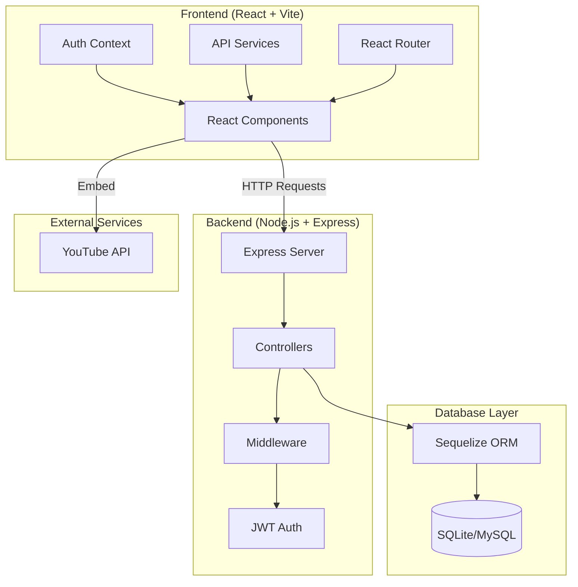

# Learn Without Limits - Learning Management System (LMS)

<p align="center">
  
  
  
  
</p>

<p align="center">
  <b>A full-stack Learning Management System with YouTube video integration, progress tracking, and role-based access control.</b>
</p>

---

## Table of Contents

- [Overview](#overview)
- [Features](#features)
- [Architecture](#architecture)
- [Project Structure](#project-structure)
- [Installation & Setup](#installation--setup)
- [Database Schema](#database-schema)
- [API Documentation](#api-documentation)
- [Frontend Components](#frontend-components)
- [Environment Variables](#environment-variables)
- [Deployment Guide](#deployment-guide)
- [Screenshots](#screenshots)
- [Contributing](#contributing)

---

## Overview

**Learn Without Limits** is a comprehensive Learning Management System designed to deliver educational content through embedded YouTube videos. The platform supports multiple user roles (Student, Instructor, Admin), course enrollment, progress tracking, and a seamless learning experience.

### Key Highlights

- **YouTube Integration**: All course videos are embedded YouTube videos - no video hosting required
- **Progress Tracking**: Real-time tracking of completed lessons with percentage calculation
- **Role-Based Access**: Different permissions for Students, Instructors, and Admins
- **Responsive Design**: Modern UI that works across devices
- **Secure Authentication**: JWT-based authentication with password hashing

---

## Features

### 1. Authentication Module

```javascript
// Backend: JWT Token Generation
const generateToken = (user) => {
  return jwt.sign(
    { 
      id: user.id, 
      email: user.email, 
      role: user.role 
    },
    process.env.JWT_SECRET,
    { expiresIn: '7d' }
  );
};
```

- **Signup**: New users can register with email, password, and full name
- **Login**: Existing users can authenticate to access protected routes
- **Role Assignment**: Users are assigned roles (student, instructor, admin)
- **Token Storage**: JWT tokens stored in localStorage for session management

### 2. Course Management

| Feature | Description |
|---------|-------------|
| Course Listing | Public page displaying all available courses |
| Course Details | Detailed view with sections, lessons, and enrollment button |
| Categories | Courses organized by categories (Programming, etc.) |
| Thumbnails | YouTube video thumbnails as course images |

### 3. Section & Lesson Structure

```
Course (e.g., "Complete Java Programming")
├── Section 1: Core Java
│   ├── Lesson 1: Setup and Installation
│   ├── Lesson 2: Variables and Data Types
│   ├── Lesson 3: Flow Statements
│   ├── Lesson 4: Object Oriented Programming
│   └── Lesson 5: Arrays and Collections
├── Section 2: Intermediate Java
│   ├── Lesson 1: Advanced OOP Concepts
│   ├── Lesson 2: Data Structures
│   └── Lesson 3: Error Handling
└── Section 3: Advanced Java
    ├── Lesson 1: System Design
    ├── Lesson 2: Concurrency and Threading
    ├── Lesson 3: JVM Tuning
    └── Lesson 4: Live Project
```

### 4. Enrollment System

```javascript
// Enrollment API
POST /api/enrollments
{
  "course_id": 1
}

// Response
{
  "message": "Successfully enrolled in course.",
  "enrollment": {
    "id": 1,
    "user_id": 5,
    "course_id": 1,
    "status": "active",
    "enrolled_at": "2026-03-03T10:00:00.000Z"
  }
}
```

### 5. Progress Tracking

```javascript
// Progress Calculation
const progressPercentage = Math.round(
  (completedLessons / totalLessons) * 100
);
```

- Tracks which lessons are completed
- Calculates overall course progress percentage
- Displays progress bar in learning interface
- Stores completion timestamp

---

## Architecture



### Technology Stack

| Layer | Technology | Purpose |
|-------|------------|---------|
| Frontend | React 18 | UI Library |
| Frontend | Vite | Build Tool |
| Frontend | React Router | Navigation |
| Frontend | Axios | HTTP Client |
| Backend | Node.js | Runtime |
| Backend | Express | Web Framework |
| Backend | Sequelize | ORM |
| Database | SQLite | Local Development |
| Database | MySQL | Production (Aiven) |
| Auth | JWT | Token-based Auth |
| Auth | bcryptjs | Password Hashing |

---

## Project Structure

```
LMS/
├── backend/                    # Node.js Backend API
│   ├── config/
│   │   └── database.js        # Database configuration
│   ├── controllers/
│   │   ├── authController.js  # Authentication logic
│   │   ├── courseController.js # Course management
│   │   ├── lessonController.js # Lesson management
│   │   ├── enrollmentController.js # Enrollment handling
│   │   └── progressController.js   # Progress tracking
│   ├── middleware/
│   │   ├── auth.js            # JWT verification
│   │   └── roleCheck.js       # Role-based access
│   ├── models/
│   │   ├── index.js           # Model relationships
│   │   ├── User.js            # User model
│   │   ├── Course.js          # Course model
│   │   ├── Section.js         # Section model
│   │   ├── Lesson.js          # Lesson model
│   │   ├── Enrollment.js      # Enrollment model
│   │   ├── Progress.js        # Progress model
│   │   └── Category.js        # Category model
│   ├── routes/
│   │   ├── auth.js            # Auth routes
│   │   ├── courses.js         # Course routes
│   │   ├── lessons.js         # Lesson routes
│   │   ├── enrollments.js     # Enrollment routes
│   │   └── progress.js        # Progress routes
│   ├── utils/
│   │   └── jwt.js             # JWT utilities
│   ├── .env                   # Environment variables
│   ├── .gitignore
│   ├── package.json
│   ├── seed.js                # Database seeding
│   └── server.js              # Entry point
│
├── frontend/                   # React Frontend
│   ├── src/
│   │   ├── components/
│   │   │   ├── Navbar.jsx     # Navigation bar
│   │   │   ├── CourseCard.jsx # Course card component
│   │   │   ├── CourseList.jsx # Course list grid
│   │   │   ├── VideoPlayer.jsx # YouTube video player
│   │   │   ├── LessonSidebar.jsx # Lesson navigation
│   │   │   └── ProgressBar.jsx   # Progress indicator
│   │   ├── pages/
│   │   │   ├── Home.jsx       # Home page
│   │   │   ├── Login.jsx      # Login page
│   │   │   ├── Signup.jsx     # Signup page
│   │   │   ├── CourseDetail.jsx # Course detail page
│   │   │   └── Learning.jsx   # Learning page
│   │   ├── context/
│   │   │   └── AuthContext.jsx # Authentication context
│   │   ├── services/
│   │   │   └── api.js         # API service functions
│   │   ├── App.jsx            # Main app component
│   │   └── main.jsx           # Entry point
│   ├── index.html
│   ├── package.json
│   ├── vite.config.js
│   └── .gitignore
│
├── .gitignore
└── README.md
```

---

## Installation & Setup

### Prerequisites

- Node.js (v16 or higher)
- npm or yarn
- Git

### Step 1: Clone the Repository

```bash
git clone https://github.com/Varshaaa0620/Learn_without_limits.git
cd Learn_without_limits
```

### Step 2: Backend Setup

```bash
# Navigate to backend directory
cd backend

# Install dependencies
npm install

# Create environment file
cp .env.example .env

# Edit .env with your configuration
# For local development, SQLite is used automatically

# Seed the database
node seed.js

# Start the backend server
npm run dev
```

The backend will run on `http://localhost:5000`

### Step 3: Frontend Setup

```bash
# Navigate to frontend directory
cd frontend

# Install dependencies
npm install

# Start the development server
npm run dev
```

The frontend will run on `http://localhost:5173`

### Step 4: Access the Application

Open your browser and navigate to `http://localhost:5173`

---

## Database Schema

### Entity Relationship Diagram

```
┌─────────────┐       ┌─────────────┐       ┌─────────────┐
│    users    │       │   courses   │       │  categories │
├─────────────┤       ├─────────────┤       ├─────────────┤
│ id (PK)     │       │ id (PK)     │       │ id (PK)     │
│ email       │       │ title       │       │ name        │
│ password    │◄──────┤ description │       │ description │
│ full_name   │       │ thumbnail   │       └─────────────┘
│ role        │       │ category_id │◄────────────┘
│ created_at  │       │ instructor  │◄──────┐
└─────────────┘       │ created_at  │       │
       ▲              └─────────────┘       │
       │                     ▲              │
       │                     │              │
       │              ┌──────┴──────┐       │
       │              │   sections  │       │
       │              ├─────────────┤       │
       │              │ id (PK)     │       │
       │              │ course_id   │◄──────┘
       │              │ title       │
       │              │ order_number│
       │              └──────┬──────┘
       │                     │
       │              ┌──────┴──────┐
       │              │   lessons   │
       │              ├─────────────┤
       │              │ id (PK)     │
       └──────────────┤ section_id  │
                      │ title       │
       ┌──────────────┤ youtube_url │
       │              │ duration    │
       │              │ order_number│
       │              └─────────────┘
       │
┌──────┴──────┐       ┌─────────────┐
│ enrollments │       │   progress  │
├─────────────┤       ├─────────────┤
│ id (PK)     │       │ id (PK)     │
│ user_id     │◄──────┤ user_id     │
│ course_id   │       │ lesson_id   │
│ status      │       │ status      │
│ enrolled_at │       │ completed_at│
└─────────────┘       └─────────────┘
```

### Table Definitions

#### Users Table
```sql
CREATE TABLE users (
  id INT PRIMARY KEY AUTO_INCREMENT,
  email VARCHAR(255) UNIQUE NOT NULL,
  password_hash VARCHAR(255) NOT NULL,
  full_name VARCHAR(255) NOT NULL,
  role ENUM('student', 'instructor', 'admin') DEFAULT 'student',
  created_at TIMESTAMP DEFAULT CURRENT_TIMESTAMP
);
```

#### Courses Table
```sql
CREATE TABLE courses (
  id INT PRIMARY KEY AUTO_INCREMENT,
  title VARCHAR(255) NOT NULL,
  description TEXT,
  thumbnail_url VARCHAR(500),
  category_id INT,
  instructor_id INT NOT NULL,
  created_at TIMESTAMP DEFAULT CURRENT_TIMESTAMP,
  FOREIGN KEY (category_id) REFERENCES categories(id),
  FOREIGN KEY (instructor_id) REFERENCES users(id)
);
```

#### Sections Table
```sql
CREATE TABLE sections (
  id INT PRIMARY KEY AUTO_INCREMENT,
  course_id INT NOT NULL,
  title VARCHAR(255) NOT NULL,
  order_number INT DEFAULT 1,
  created_at TIMESTAMP DEFAULT CURRENT_TIMESTAMP,
  FOREIGN KEY (course_id) REFERENCES courses(id)
);
```

#### Lessons Table
```sql
CREATE TABLE lessons (
  id INT PRIMARY KEY AUTO_INCREMENT,
  section_id INT NOT NULL,
  title VARCHAR(255) NOT NULL,
  order_number INT DEFAULT 1,
  youtube_url VARCHAR(500) NOT NULL,
  duration VARCHAR(20),
  created_at TIMESTAMP DEFAULT CURRENT_TIMESTAMP,
  FOREIGN KEY (section_id) REFERENCES sections(id)
);
```

---

## API Documentation

### Authentication Endpoints

#### POST /api/auth/signup
Register a new user.

**Request Body:**
```json
{
  "email": "student@example.com",
  "password": "securepassword",
  "full_name": "John Doe",
  "role": "student"
}
```

**Response:**
```json
{
  "message": "User created successfully.",
  "token": "eyJhbGciOiJIUzI1NiIs...",
  "user": {
    "id": 1,
    "email": "student@example.com",
    "full_name": "John Doe",
    "role": "student"
  }
}
```

#### POST /api/auth/login
Authenticate existing user.

**Request Body:**
```json
{
  "email": "student@example.com",
  "password": "securepassword"
}
```

#### GET /api/auth/me
Get current user info (requires authentication).

**Headers:**
```
Authorization: Bearer <token>
```

### Course Endpoints

#### GET /api/courses
Get all courses (public).

**Response:**
```json
{
  "courses": [
    {
      "id": 1,
      "title": "Complete Java Programming",
      "description": "Master Java from basics to advanced...",
      "thumbnail_url": "https://img.youtube.com/vi/...",
      "instructor": {
        "id": 1,
        "full_name": "Admin Instructor"
      },
      "category": {
        "id": 1,
        "name": "Programming"
      }
    }
  ]
}
```

#### GET /api/courses/:id
Get course details with sections and lessons.

#### GET /api/courses/:id/lessons
Get all lessons for a course (requires enrollment).

### Enrollment Endpoints

#### POST /api/enrollments
Enroll in a course.

**Request Body:**
```json
{
  "course_id": 1
}
```

#### GET /api/enrollments/my-courses
Get all enrolled courses for current user.

#### GET /api/enrollments/check/:course_id
Check if user is enrolled in a course.

### Progress Endpoints

#### POST /api/progress
Mark a lesson as complete.

**Request Body:**
```json
{
  "lesson_id": 5
}
```

#### GET /api/progress/:course_id
Get progress for a course.

**Response:**
```json
{
  "course_id": 1,
  "total_lessons": 25,
  "completed_lessons": 10,
  "progress_percentage": 40,
  "last_watched_lesson": 5
}
```

---

## Frontend Components

### VideoPlayer Component

```jsx
// Extracts YouTube video ID and embeds it
const VideoPlayer = ({ youtubeUrl, onComplete }) => {
  const getVideoId = (url) => {
    // Handle various YouTube URL formats
    if (url.includes('/embed/')) {
      return url.split('/embed/')[1]?.split('?')[0];
    }
    const match = url.match(/[?&]v=([^&]+)/);
    if (match) return match[1];
    return null;
  };

  return (
    <iframe
      src={`https://www.youtube.com/embed/${videoId}?rel=0`}
      allowFullScreen
    />
  );
};
```

### AuthContext

```jsx
// Provides authentication state across the app
const AuthProvider = ({ children }) => {
  const [user, setUser] = useState(null);
  
  const login = async (email, password) => {
    const response = await authAPI.login({ email, password });
    const { token, user } = response.data;
    localStorage.setItem('token', token);
    setUser(user);
  };

  return (
    <AuthContext.Provider value={{ user, login, logout, isAuthenticated }}>
      {children}
    </AuthContext.Provider>
  );
};
```

---

## Environment Variables

### Backend (.env)

```env
# Database Configuration (Aiven MySQL for production)
# Uncomment these lines to use Aiven MySQL
# DB_HOST=mysql-20abe010-varshaa.h.aivencloud.com
# DB_PORT=13376
# DB_USER=avnadmin
# DB_PASSWORD=your_password
# DB_NAME=defaultdb

# Local development (SQLite will be used)
DB_HOST=localhost
DB_PORT=3306
DB_USER=root
DB_PASSWORD=
DB_NAME=lms_database

# JWT Secret
JWT_SECRET=your_jwt_secret_key_here

# Server Port
PORT=5000
```

### Frontend (.env)

```env
VITE_API_URL=http://localhost:5000/api
```

---

## Deployment Guide

### Deploying to Aiven MySQL

1. **Update Environment Variables:**
   ```env
   DB_HOST=your_aiven_host
   DB_PORT=13376
   DB_USER=your_username
   DB_PASSWORD=your_password
   DB_NAME=defaultdb
   ```

2. **Install MySQL Driver:**
   ```bash
   npm install mysql2
   ```

3. **Run Database Seeding:**
   ```bash
   node seed.js
   ```

4. **Start the Server:**
   ```bash
   npm start
   ```

### Deploying Frontend

```bash
cd frontend
npm run build
```

The `dist` folder will contain the production build.

---

## Course Data

The LMS comes pre-seeded with two comprehensive courses:

### 1. Complete Java Programming

| Section | Lessons |
|---------|---------|
| Core Java | Setup, Variables, Flow Statements, OOP, Arrays |
| Intermediate Java | Advanced OOP, Data Structures, Error Handling |
| Advanced Java | System Design, Concurrency, JVM Tuning, Live Project |

**Total Lessons:** 12

### 2. Complete Python Programming

| Section | Lessons |
|---------|---------|
| Core Python | Data Types, Control Statements, Functions, Loops, Error Handling |
| Intermediate Python | OOP, Decorators, Generators, List Comprehensions, Exception Handling |
| Advanced Python | Asynchronous Programming, Meta Classes, Live Project |

**Total Lessons:** 13

---

## Contributing

1. Fork the repository
2. Create your feature branch (`git checkout -b feature/AmazingFeature`)
3. Commit your changes (`git commit -m 'Add some AmazingFeature'`)
4. Push to the branch (`git push origin feature/AmazingFeature`)
5. Open a Pull Request

---

## License

This project is licensed under the MIT License.

---

## Contact

**Project Link:** [https://github.com/Varshaaa0620/Learn_without_limits](https://github.com/Varshaaa0620/Learn_without_limits)

---

<p align="center">
  <b>Built with passion for learning</b>
</p>
